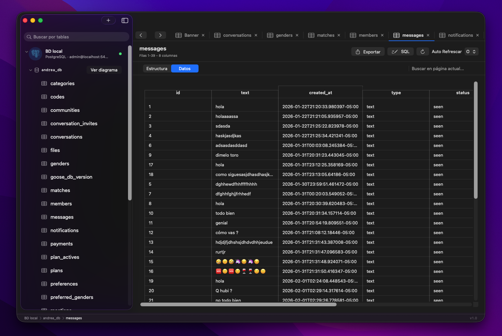
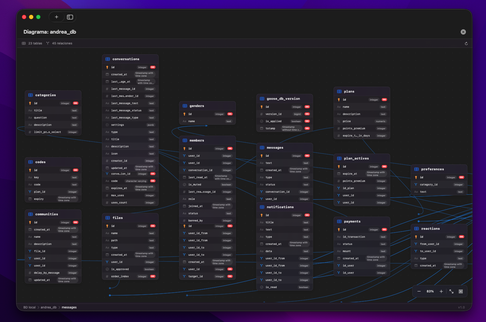
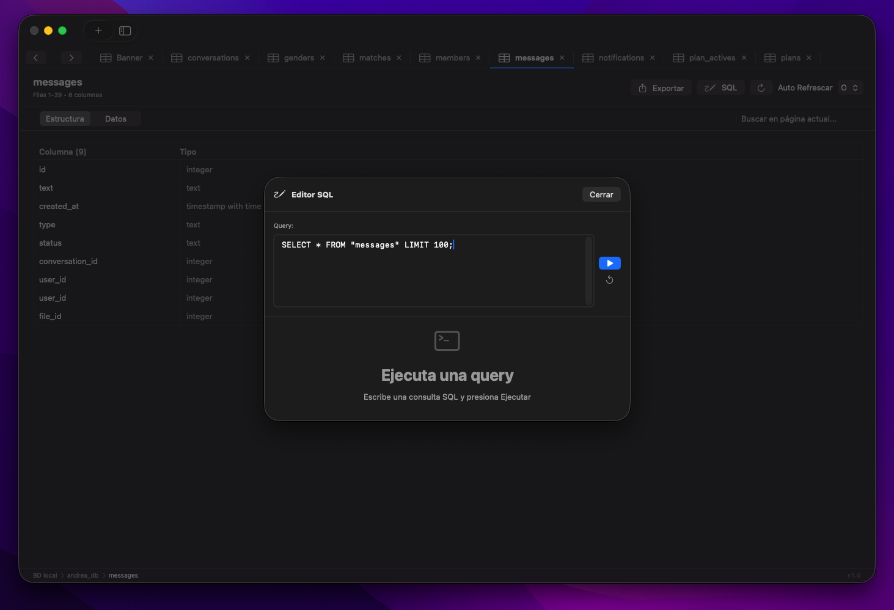
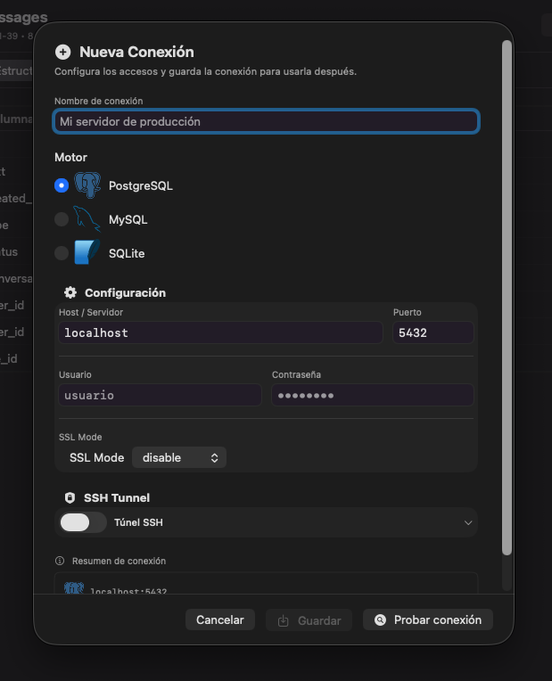

# DBOtter 
#### Interfaz nativa de Apple (SwiftUI) que no consume recursos, impulsada por un motor de datos ultraligero y eficiente (Go). Es el matrimonio perfecto: la elegancia de Apple con la fuerza bruta de Google.

<!-- <table> -->

<!-- </table> -->
### Instalación en macOS
- Descarga DBOtter-v* zip desde los release
- Doble click para descomprimir → obtienes DBOtter.app
- Arrastra DBOtter.app a tu carpeta Applications
- Primera ejecución (solo la primera vez):
  - Opción A (GUI): Click derecho en DBOtter.app → Abrir → Click Abrir
  - Opción B (Terminal): xattr -cr /Applications/DBOtter.app
- ¡Listo! La app ya abre normal en futuras ejecuciones
##### Nota: La app no está firmada con certificado Developer ID ($99/año), por eso macOS pide confirmación la primera vez. Es seguro: el código es abierto y se compila en GitHub Actions.

### Qué incluye
- Interfaz nativa SwiftUI (macOS 26+)
- Motor Go embebido para PostgreSQL, MySQL, SQLite
- Túnel SSH integrado (password / clave privada / clave inline)
- Exportación CSV, Excel, JSON, SQL
- Autocompletado SQL con Runestone

### PARA COMPILAR CORE GO
- MacOS: GOOS=darwin GOARCH=arm64 go build -o core-engine main.go

##### Proyecto abierto para nuevas integraciones con otros Sistemas operativos, consumiendo solo el core-engine. Y para mejorar y agregar nuevos motores de base de datos en el futuro